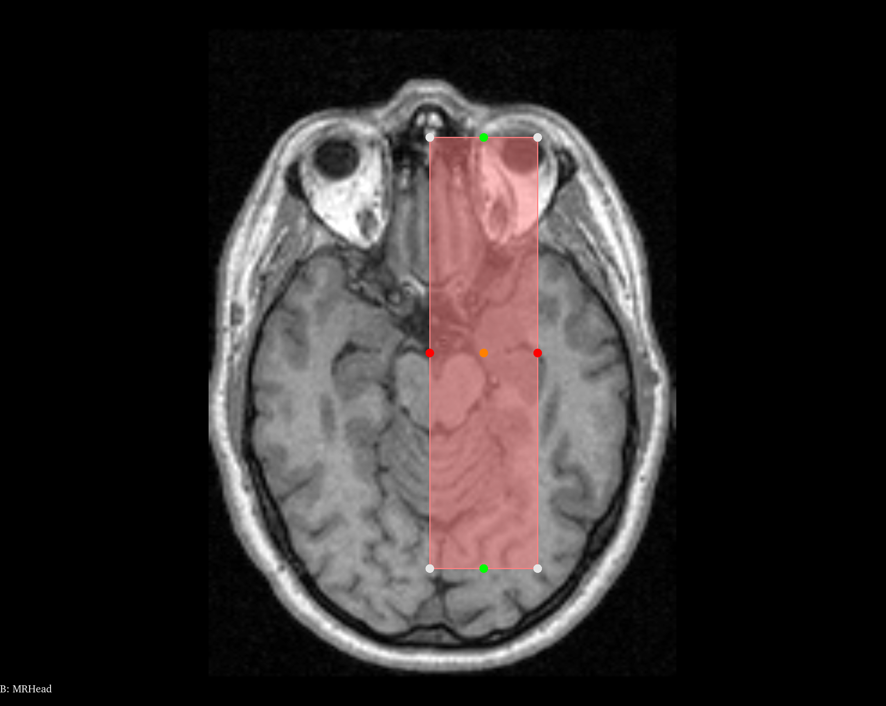
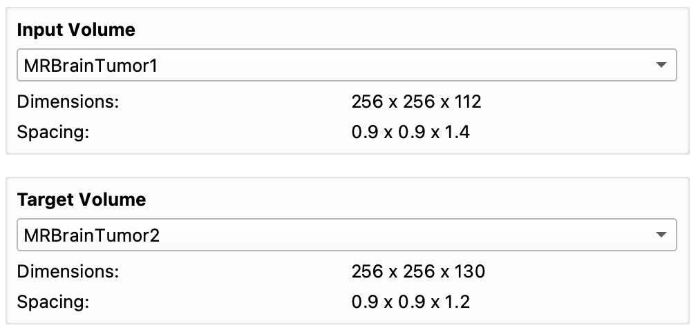

# Custom Registration

Custom Registration is a 3D image registration extension for 3D Slicer. It allows applying preprocessing to the images (ROI selection, cropping, and resampling), running rigid and non-rigid registration algorithms, computing and visualizing difference maps, and running your algorithms with your graphical interface plugged in.

**Members:** [Wissam Boussella](mailto:wissamboussella@gmail.com), [Iantsa Provost](mailto:iantsa.provost@gmail.com), [Bastien Soucasse](mailto:bastien.soucasse@icloud.com), and [Tony Wolff](mailto:toto.wolff@live.fr).

**Supervisors:** [Fabien Baldacci](mailto:fabien.baldacci@u-bordeaux.fr) and [Pascal Desbarats](mailto:pascal.desbarats@labri.fr).

## Getting Started

### 3D Slicer

As Custom Registation is an extension, you must have [3D Slicer](https://slicer.org) installed on your system. You can either install or build the software by following [the documentation](https://slicer.readthedocs.io/en/latest/user_guide/getting_started.html).

### Installing the Extension

Follow these instructions to install the extension from a release archive. Note you can instead build the extension from the source by following the instructions in [Building from Source](#building-from-source).

**The installation process from a release archive is not yet available. Please refer to the manual build instructions in [Building from Source](#building-from-source).**

### Building from Source

Follow these instructions to build the extension from the source. Note you can instead install the extension from a release archive by following the instructions in [Installing the Extension](#installing-the-extension).

#### 3D Slicer Developer Mode

Activate the developer mode in 3D Slicer if not already done. You can achieve this by going into the _Application Settings_ (in the _Edit_ menu). Under _Developer_, check _Enable developer mode_ and restart the software.

#### 3D Slicer Source Build

To import the extension into 3D Slicer, you need to open the _Extension Wizard_ (in the _Developer Tools_ section of the module selector). Hit _Select Extension_ and open the `src` directory containing the sources of the extension. In the next dialog, make sure to load the _Custom Registration_ module.

### Launching the Extension Module

In Slicer, you can now find the Custom Registration module in the module selector (inside the _PFE_ section).

Launching this module might update the view and change the layout of the software. All previous data is saved and can be used from the Custom Registration module.

## Using Custom Registration

### Preprocessing

#### ROI Selection

ROI selection allows you to define the relevant information of the image. You can use it to automatically crop the image with [the cropping feature](#cropping), or with you own algorithms thanks to [the plugins](#plugins).

To select the ROI of an image (or two), first select an image as input (and one as target). Head over to the _ROI Selection_ of the Custom Registration module panel.

You can select the ROI by thresholding the image(s) with the slider(s). The threshold will appear red over the image.

When _Select ROI_ is clicked, the largest conected component will be kept as the ROI and will appear green over the image.

#### Cropping

You can crop your image either manually, or automatically around the ROI in your image.

##### Manual

To manually crop an image, select it as input image and open the _Cropping_ section of the Custom Registration module panel, with the _Manual_ mode.

You can enter the start and end positions of the crop region. A bounding box will appear over the image.

Once you click the _Crop_ button, a new image corresponding to the cropped image will be created and selected as the new input image.

##### Automatic

To automatically crop an image, select it as input image, select a ROI, and open the _Cropping_ section of the Custom Registration module panel, with the _Automatic_ mode.

You can enter the margins around the ROI. A bounding box will appear over the image.

Once you click the _Crop_ button, a new image corresponding to the cropped image will be created and selected as the new input image.

#### Resampling

You can resample an image automatically to match another image's dimensions and pixel spacing (for registration, difference map computation, etc.).

First, select the image you want to resample as input image, and the image you want to match as target image.

Then, you can simply open the _Resampling_ section of the Custom Registration module panel, and click the _Resample_ button.

A new image corresponding to the cropped image will be created and selected as the new input image. You can check the new dimensions and pixel spacing.

### Registration

Multiple registration possibilities are at your disposal. You have the choice between SimpleITK based or SlicerElastix based registration. After the your selection, other settings will help you tune your registration as you wish to get the results you need. Among important parameters you must use are metrics, optimizers, and interpolators (Remark : those settings are unecessary when choosing an Elastix presets, this library is independent).

For a simple rigid registration, after the selection of the volume to registrate and the fixed volume, Gradient Descent optimizer and the linear interpolator is recommended. You can tune the gradient descent parameters once you have selected the Rigid sitk algorithm and gradient descent, but the default parameters should be enough.

After you have adjusted your inputs for the available parameters. You can press the **Apply** Button, you will have access to a cancel button if the computation is taking too much time.

After registration, the result will be displayed in the red window.

Here is a recap of other registration algorithms you may use.

- Rigid: Process of aligning two images by applying a 3D transformation that includes rotation and translation.
- Affine: Process of aligning two images by applying a 3D transformation that includes rotation, translation, scaling and shearing.
- Non Rigid B-Spline: Process of aligning two images by applying a 3D transformation that includes deformation.
- Demons: Non-rigid registration, it estimates force vectors that drive the deformation toward alignment and smoothing the force vectors by Gaussian convolution.
- Elastix Rigid: Elastix preset to apply a rigid regisration.
- Elastix Non Rigid: Elastix preset to apply a non-rigid registration.
- Other Elastix presets and Demons.

The **Settings** panel is only available for sitk algorithms. All parameters have a by default value, so you do not have to tune any parameters.

_Note that non rigid BSpline is taking a very long time with gradient descent, you may prefer the LBFGSB optimizer instead._

### Difference Map

…

### Plugins

Plugins are the easiest way to add new features to Custom Registration by importing graphical interfaces and algorithms into the extension module.

You can load existing plugins from the _Plugins_ resource folder (`src/CustomRegistration/Resources/Plugins`). But you can also create and load your own plugins to add features of your choice to Custom Registration.

A plugin consists of two files:

- A graphical interface stored in an UI (XML) file: `.ui`. This file must contain all the widgets you will want to manipulate to apply parameters to your algorithm. You can write your own or more easily generate one with dedicated tools such as Slicer's pre-built designer, which you can find into the _Application Settings_ (in the _Edit_ menu), under _Developer_ menu, or Qt Designer (also included in Qt Creator)–but you might be missing Slicer's custom widgets with the latter.
- A script stored in a Python file: `.py`. The script must contain a `run` function. Keep it mind that this function is only an entry point for your plugin. You can write all your script inside, use different functions and files, or even call algorithms written in different languages or from libraries. The `run` function receives four parameters:
  - `ui`: Your plugin graphical interface to retrieve data from (parameters, other values…). You can retrieve any element from your graphical interface as an object by using `ui.findChild(type, name)`, to access and control its value.
  - `scene`: Slicer's MRML Scene (for adding, removing, or editing volumes and other nodes). You can check its usage in [Slicer's documentation](https://slicer.readthedocs.io/en/latest/developer_guide/mrml_overview.html).
  - `input_volume`: The input volume defined in Custom Registration (appearing in the top view), which is the one that is either preprocessed or registered. If no volume is selected as input, its value will be `None`.
  - `target_volume`: The target volume defined in Custom Registration (appearing in the bottom-left view), which is the one that is selected as target to process the input volume accordingly. If no volume is selected as target, its value will be `None`.

#### Loading a Plugin

Head over to the _Plugins_ section of the Custom Registration module panel, where you can find a _Load Plugin_ button.

When clicked, a _Plugin Loading_ dialog window opens. You can choose a name for your plugin, and load the graphical interface and script files. You can then hit _Load_ to add your plugin to the extension module.

Once loaded, your plugin appears after the plugin loading area, under a collapible button named as your plugin. You can there find your graphical interface and a _Run_ button to execute your script.

